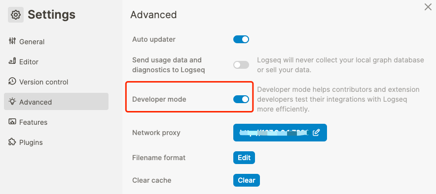
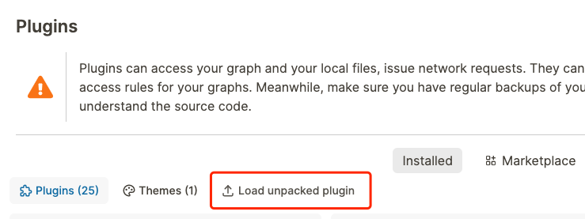
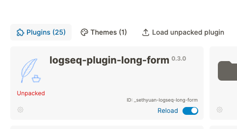

English | [中文](README.zh.md)

# logseq-plugin-long-form

A long form editing experience for Logseq.

## How to Install

1. Download the newest zip file from the [Releases](https://github.com/sethyuan/logseq-long-form/releases) page.
1. Unzip the zip file into the folder where you want to store the plugin.
1. Turn on the developer mode in Logseq. 
1. Load the unzipped folder (named `logseq-long-form`) by clicking on the `Load unpacked plugin` button on the plugins modal. 
1. You should now see the plugin being installed. 

## Usage

### Enter/Exit Long Form Mode

https://github.com/sethyuan/logseq-long-form/assets/3410293/9a1a2689-e606-4ec7-a4dc-e899d6480473

### Headings

#### Markdown Headings

https://github.com/sethyuan/logseq-long-form/assets/3410293/fd82b82a-a232-4ec7-83bf-96ba4c725bd4

#### Auto Headings

https://github.com/sethyuan/logseq-long-form/assets/3410293/ef92672a-8692-4665-ab6c-27938cebe056

### Visual Aids

https://github.com/sethyuan/logseq-long-form/assets/3410293/683107a9-1d68-42c2-a41c-18f4e7b8b00c

### Lists

https://github.com/sethyuan/logseq-long-form/assets/3410293/bd768b71-dad5-44b6-9e71-319cc45f2b67

### Visual Indentation

https://github.com/sethyuan/logseq-long-form/assets/3410293/22883e6e-4aee-442e-88dd-7900c921a656

### Long Form + TOC Generator

https://github.com/sethyuan/logseq-long-form/assets/3410293/0147a54e-9dee-4f6d-99eb-9bb909d4303d

### Export to Markdown

https://github.com/sethyuan/logseq-long-form/assets/3410293/5a43a384-34aa-47e2-a86b-fa2f9c22bebe

## Join the community

Join the Discord channel [here](https://discord.gg/E7TA5rUuKE) where we discuss everything related to the plugin.
